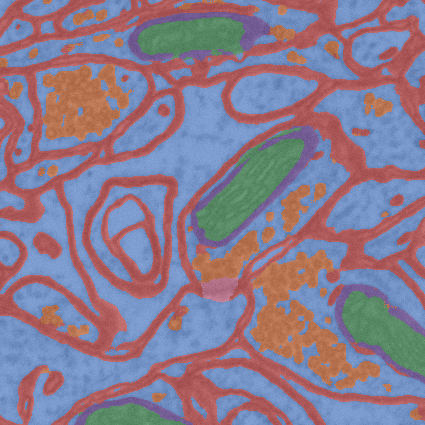
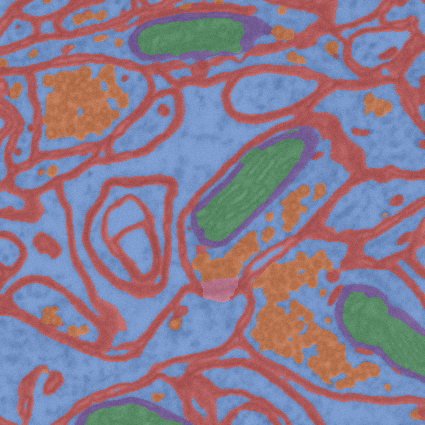

# connectomics_segmentation

This is my research project at TU Dresden (CMS program).

The aim of the work is to develop semantic segmentation models for the connectomics volume images given limited amount of labeled data. This README is just a high-level
overview, for more detailed information please read the [report](https://github.com/ShkalikovOleh/connectomics_segmentation/blob/master/report/report/report.pdf) and [slides](https://github.com/ShkalikovOleh/connectomics_segmentation/blob/master/report/slides/slides.pdf).

## Data

The original image volumes are acquired by a focused ion beam scanning electron microscope (FIB-SEM) of the CA1 hippocampus region of the brain.
The raw data has a shape 2048 x 1536 x 1065.

The actual labeling has been performed only on 9 slices of subvolumes into the following classes:
1. cell cytoplasm
2. cell membrane
3. mitochondrion
4. mitochondrion membrane
5. synapse
6. vesicle
7. undefined (in the case where annotator was uncertain about the correct label)

This 9 slices have been split into training, validation and test sets (3 slice for each). The shape of training slices is 600 x 600, whereas for validation and test - 425 x 425.

The main limitations of the dataset are the following:
- Labeling by non expert => there may be some mistakes in labeling
- Limited size (even for artificial data generation via GANs, because we need data to train a discriminator for masks)
- Most interesting and hardest regions are unlabeled
- Labels only for slices => can not use SOTA segmentation models (because their input and output shapes are the same)
- One label per voxel => can not perform multi label classification
- High class imbalance

## Methodology

### Models
The main idea to handle the problem of limited size of data and especially the fact that we have only labeled slices (not volumes) is to predict a label only for a center voxel of an input subvolume, e.g. the input to a model has shape 32 x 32 x 32 but a model outputs predictions only for the center voxel with coordinates (16, 16, 16).

First of all some classical voxelwise models (supervised and unsupervised) have been used. The quality of predictions of these models is very low and you can check them in [notebooks](https://github.com/ShkalikovOleh/connectomics_segmentation/tree/master/notebooks).

The main type of models is CNN. All of them consist of a backbone and a head.
For backbones a lot of handcrafted models have been created in addition to adapted to 3D case ConvNext-tiny model (just replace 2D convs with 3D convs). The classification head was shared for all models and it is a simple linear layer.

Our project is fully configurable with `yaml` configs (inspired by [this repo](https://github.com/ashleve/lightning-hydra-template)) and you can find all model [backbones](https://github.com/ShkalikovOleh/connectomics_segmentation/tree/master/configs/model/backbone) and heads descriptions as well as other configs in the [configs](https://github.com/ShkalikovOleh/connectomics_segmentation/tree/master/configs) directory. Usually model's configs just use already implemented blocks which you can find in the source code available in the [connectomics_segmentation](https://github.com/ShkalikovOleh/connectomics_segmentation/tree/master/connectomics_segmentation) directory.

### Post processing

Since models predict a label for center voxels independently
(adjacent voxels only shares part of an input) it is possible that the final predicted mask for the whole volume will not be consistent, i.e. similar, close to each voxel will have different labels and the whole output will look noisy. Some 2D CNN segmentation models, like DeepLab, solve this issue by using CRF model on the predictions of a model. But whereas the usual approach
to smooth predictions is a local CRF (which work on a voxel and its neighborhood), we use a fully connected CRF, i.e. CRF where every voxel of the predicted volume is connected. This will allows us to guarantee not only a local consistency, but capture a global structure as well.

But since solving the discrete optimization problem for fully connected graphs for meaningful size of a volume can become computationally intractable we constrained the CRF model to have a specific type which can be solved efficiently, i.e. CRF with [gaussian edge potentials](https://arxiv.org/abs/1210.5644).

### Pretraining

Initially pretraining approaches such as masked token prediction
or a next token prediction have shown their efficiency for NLP tasks. The main idea is to use only unlabeled data and train model to predict some masked part of it which allows model to better understand the structure of data (language) and only then finetune model on labeled dataset to some specific task.
In the last years it has been proved (e.g. ConvNext2) that CNN models also can benefit from pretraining in the similar way, i.e. by masking part of the image with the aim of its reconstruction via autoencoder.

Inspired by this ideas 2 types of pretraining techniques have been proposed for our task.
It is possible because every CNN can be split into 2 parts: a backbone which extracts features and a head which depends on the task. So, during the pretraining we will train the backbone of a model and then during finetuning change the head to a classification one. Therefore all our pretraining methods differs only in heads.

The first pretraining method is a center voxel regression. We mask the center voxel
(optionally with padding, e.g. if padding 1 then we mask \( 3 \times 3 \) center region)
and train our model to predict the intensities in the masked region. This method is based on the findings from data analysis (intensity for almost all classes are different therefore intensity itself
can help to predict a correct label).

The second approach is a training of a variational autoencoder (VAE) where we
optionally mask the center voxel (optionally with padding, i.e. some center region) and reconstruct the whole input (including the masked
center region) using VAE framework.

All these pretraining techniques have been applied mostly to big models (like adapted ConvNext).

## Results

A lot of experiments have been conducted with a lot of backbones, losses and input shapes. All metrics and visualizations obtained during training and evaluation of models can be found on [WandB](https://wandb.ai/shkalikov-oleh/connectomics_segmentation).

### Raw predictions

Here is the evaluation results (on test split) for top 7 trained model. It is very
interesting that relatively simple small models are at the top whereas ConvNexts are at the middle and bottom.

| Model | Input size | Loss          | F1    | AP    | Cohen's kappa |
| ----- | ----------- | ------------- | ----- | ----- | ----------------------- |
| 4_conv_resnet           | 32                   | CE                     | 0.913 | 0.962 | 0.939           |
| 4_conv          | 32                   | CE                     | 0.906          | 0.952          | 0.938                    |
| 4_conv_resnet\_ln       | 32                   | CE                     | 0.905          | 0.959          | 0.937                    |
| dilated_conv_2_layer            | 32                   | CE                     | 0.885          | 0.95           | 0.923                    |
| 4_conv_resnet           | 16                   | CE                     | 0.883          | 0.933          | 0.926                    |
| 4_conv_resnet\_ln       | 16                   | CE                     | 0.851          | 0.925          | 0.918                    |
| dilated_conv_2_layer            | 32                   | Focal (gamma = 2) | 0.828          | 0.886          | 0.894                    |

But as it has been already stated in the data description part the hardest regions of the volumes are unlabeled, so these metrics potentially don't show us the real
quality of models, but since we just don't have any fully labeled slices for proper evaluation "маємо те, що маємо" :)

### Post processed predictions

Then the CRF post processing step has been applied to the raw predictions of the models. The parameters for CRF have been chosen manually based on some simple heuristic like the penalty for adjacent cell membrane and mitochondrion should be high because they have to be split by at least mitochondrion membrane.

|Model | Input size | Loss          | F1     | Cohen's kappa     |
| ---- | ----------- | ------------- | -----  | ----------------- |
|4_conv_resnet           | 32                   | CE                     | 0.901 (-0.012)              | 0.937 (-0.002) |
|4_conv          | 32                   | CE                     | 0.902 (-0.004)     | 0.935 (-0.003)          |
|4_conv_resnet\_ln       | 32                   | CE                     | 0.897  (-0.008)             | 0.930 (-0.007)          |
|dilated_conv_2_layer            | 32                   | CE                     | 0.828  (-0.057)             | 0.868 (-0.064)          |
|4_conv_resnet           | 16                   | CE                     | 0.878  (-0.005)             | 0.922 (-0.004)          |
|4_conv_resnet\_ln       | 16                   | CE                     | 0.846  (-0.005)             | 0.916  (-0.002)         |
|dilated_conv_2_layer            | 32                   | Focal (gamma = 2) | 0.828  (0) | 0.893  (-0.001)         |

Based only on metrics the postprpocesed results are worse, but actually if we look at the visualization of predictions they are more structurally correct, i.e. CRF has closed mitochondria membranes and after postprocessing all mitochondria are surrounded by membranes. Also CRF has replaced wrongly predicted to vesicles labels in the right bottom mitochondrion to the proper mitochondrion labels.

The visualization of raw  (left) and CRF post processed (right) predictions:

